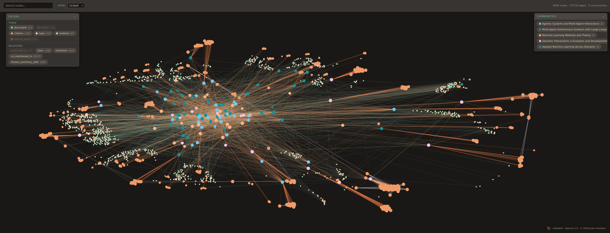
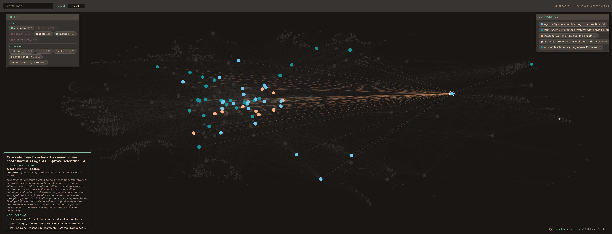
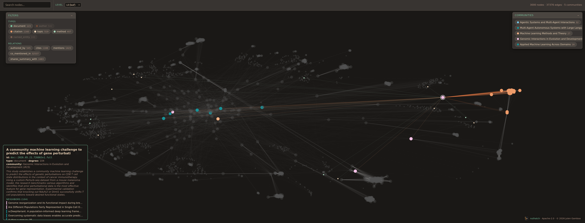
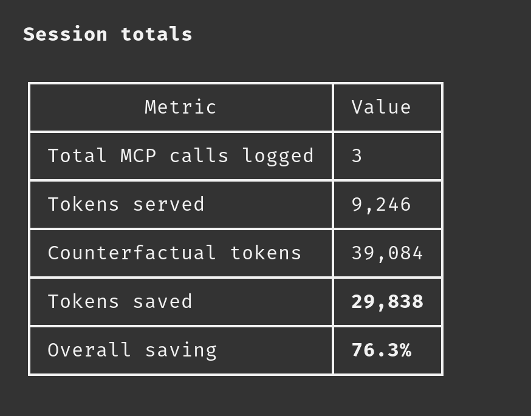
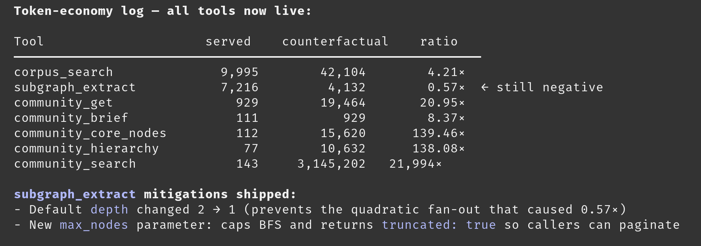

# Nuthatch

<p align="center">
  
</p>

> Local-first knowledge-graph tool for structured corpora, with
> principled clustering, strict ingest-time schema validation, and
> honest LLM token-economy accounting.

## What this is

Nuthatch turns a curated corpus (research papers, patents, internal
documents, technical reports, notes, Repomix-preprocessed codebases,
or any text-based source) into a navigable knowledge graph and
serves it to an MCP-aware agent (Claude Code, Codex, OpenCode,
Aider, Pi, Hermes, an Obsidian plugin, or your own client). The
agent queries the graph through nine read-only MCP tools; the
operator drives the build pipeline through a five-stage CLI.

The rendered corpus also opens as an Obsidian-compatible vault:
per-paper cards live under `cards/`, per-community pages under
`communities/`, with `dashboard.md` / `index.md` / `log.md` at
the top. Wikilinks between cards drive Obsidian's graph view;
Dataview queries in the dashboard filter by tag / year / community.

The corpus type is a schema profile, not a category constraint.
Nuthatch is designed for any structured-corpus problem where
graph-augmented retrieval helps.

## Why it exists

The graph-augmented retrieval space has working open-source
implementations (Microsoft GraphRAG, graphify, LightRAG, HippoRAG,
nano-graphrag) plus adjacent tools (Cognee, PaperQA2, Khoj, Verba).
We surveyed them and built Nuthatch anyway because we wanted a
specific combination of choices none of them makes:

- **Community-aware retrieval, not just clustering.** Every chunk
  hit carries `community_id`, `community_path` (the nested SBM
  chain), and `community_label` so an agent can route directly
  into the relevant cluster without paying for a card fetch first.
  Plus `community_search` ranks communities semantically by
  query-to-centroid cosine; flat modularity-based clustering
  (Leiden, Louvain) cannot do this. See
  [`docs/Design_Decisions.md`](docs/Design_Decisions.md) §
  *Community-aware retrieval*.
- **Bayesian Stochastic Block Model** (Peixoto, via
  [graph-tool](https://graph-tool.skewed.de/)) as the principled
  clustering ceiling, with Leiden as a graceful fallback when
  graph-tool is unavailable. The SBM tier emits a nested hierarchy
  that flat methods cannot, and Nuthatch persists every level so
  agents can zoom from leaf clusters up to coarser super-clusters.
- **Honest per-tool token-economy accounting** (BM25 baseline for
  search, card-token-sum baseline for subgraph and community)
  instead of whole-corpus headline ratios.
- **Build pipeline triggered out-of-band** by the operator with
  quality gates between stages, never end-to-end unattended.
- **Strict schema quarantine on ingest** with reasoned per-file
  failure sidecars.
- **Authoritative metadata fetched from publisher APIs** (arxiv,
  bioRxiv) rather than parsed from PDF body text.
- **User-extensible schema profiles** supporting papers, patents,
  internal documents, and arbitrary user-defined types.
- **A read-only MCP query surface** that the agent cannot mutate.

## Quick start

See [`docs/HOWTO.md`](docs/HOWTO.md) for the full operator guide
covering install, corpus initialisation, the five-stage build
pipeline, MCP registration per agent host, and stop / resume
semantics. The short version:

```bash
pipx install git+https://github.com/evoclock/nuthatch.git@main
nuthatch init ~/my-corpus --register-as my-corpus --set-default

# Drop sources anywhere under the corpus root (inbox/, arxiv/,
# bioarxiv/, notes/, root-level: your choice). Then trigger each
# pipeline stage in sequence and inspect between stages.

scripts/ops/launch-stage.sh ingest  my-corpus
scripts/ops/launch-stage.sh embed   my-corpus
scripts/ops/launch-stage.sh graph   my-corpus
scripts/ops/launch-stage.sh cluster my-corpus
nuthatch render --corpus my-corpus

# Then serve it to an MCP-aware agent:
nuthatch serve --corpus my-corpus
```

A pre-built reference corpus
([nuthatch-kb-demo](https://github.com/evoclock/nuthatch-kb-demo))
is available to explore before building your own.

## Documentation

- [`docs/Design_Decisions.md`](docs/Design_Decisions.md): architectural
  choices and the reasoning behind each, including the peer-landscape
  survey and the token-economy methodology
- [`docs/HOWTO.md`](docs/HOWTO.md): operator runbook for the
  five-stage pipeline plus the MCP query surface
- [`docs/SPEC.md`](docs/SPEC.md): the architecture spine
- [`docs/extraction-benchmarks/ocr-comparison.md`](docs/extraction-benchmarks/ocr-comparison.md):
  evidence for the OCR routing decisions (Chandra vs Docling vs
  EasyOCR vs Granite vs SmolDocling across three representative
  scanned papers)
- Per-agent skill files under `agent_skills/` (`skill-claude-code.md`,
  `skill-codex.md`, `skill-aider.md`, `skill-opencode.md`,
  `skill-pi.md`, `skill-hermes.md`) for MCP registration details and
  recommended multi-step query flows

## Extraction and model stack

This section documents the exact tools and models used to build the reference
corpus. It is here so others can replicate the setup or substitute equivalents
at each stage.

### PDF triage

Every source PDF goes through a cheap pre-flight pass with `pdftotext`
(poppler) before any extraction cost is paid. If the text layer is present
and dense enough the document is classified as born-digital; otherwise it
is routed to one of the OCR paths below.

### Extraction routing

| Input type | Condition | Extractor |
|---|---|---|
| Born-digital PDF | always | Docling (no OCR) |
| Scanned PDF | GPU available, max quality | Chandra OCR 2 |
| Scanned PDF | GPU available, not max quality | Granite-Docling 258M VLM |
| Scanned PDF | CPU-only | Docling + EasyOCR |
| Math span retry | per document, broken spans only | Chandra OCR 2 |

**Math span retry.** Post-extraction validation records every broken inline
math span per document (position, broken-ratio, sample). For each document
that has broken spans, all of its broken inline math spans are consolidated
into a single page; Chandra OCR 2 resolves them in one pass against that page
and the corrected expressions are traced back to their original positions.
Only the span-level corrections are applied and the deferred record is closed.

**SmolDocling** is documented as a fallback (small VLM, CPU-capable) but is
not yet wired into the routing logic.

### Embedding models

| Profile | Model | Notes |
|---|---|---|
| `scientific_paper` | SPECTER2 (AllenAI) | trained on the scientific citation graph; planned default for this profile |
| All other profiles | BGE-M3 (BAAI) | general-purpose multilingual; current default for all profiles |

### Eval stack

Evaluation runs fully locally via Ollama except where noted.

| Role | Model | Source |
|---|---|---|
| RAGAS generator / answerer | `gemini-3-flash-preview:cloud` | Ollama (local) |
| RAGAS judge / graph eval / cluster eval | `granite3-dense:8b` | Ollama (local) |
| Retrieval embeddings (eval) | BGE-M3 | same checkpoint as ingest, via `NuthatchEmbeddings` RAGAS adapter |
| Cluster label relabelling | `granite3-dense:8b` | Ollama (local), `--relabel-llm` pass |

All models listed as "Ollama (local)" run on-device with no outbound traffic.
Chandra OCR 2 and BGE-M3 likewise run locally; SPECTER2 can be served locally
via the HuggingFace `transformers` backend.

## Architecture

<p align="center">
  
</p>

The full module graph and architecture diagrams are at
[`docs/architecture/`](docs/architecture/).

## The corpus graph

<p align="center">
  
  <br/>
  <em>SBM partition with a baseline subset of filters active. Communities coloured via Catppuccin Mocha; floating boxes (Communities, Filters) are draggable and persist position to <code>localStorage</code>. Interactive version lives at <code>docs/graph.html</code> in every nuthatch-published KB; open it in any browser, no backend.</em>
</p>

<p align="center">
  
  <br/>
  <em>Most relations toggled off and the <code>cites</code> relation off: the visible structure is the SBM community as the clustering inferred it from non-citation edges (authorship, topic / method co-mentions, embedding-driven adjacency).</em>
</p>

<p align="center">
  
  <br/>
  <em>Same filter set as above, but with <code>cites</code> toggled on. The new edges show how one paper citing another can extend a community beyond what semantic / co-mention signals alone would produce. The contrast between the previous frame and this one is the citation-extension effect made visible.</em>
</p>

## Demo

<p align="center">
  <a href="https://www.youtube.com/watch?v=BlyR4Qi6fsI">
    
  </a>
</p>

## Token economy

<p align="center">
  
  <br/>
  <em>Per-tool token-economy report from <code>token_econ_report</code>. Each tool is measured against two honest baselines: BM25 (what a flat keyword search over the whole corpus would cost) for search tools, and card-token-sum (the cost of fetching every card) for subgraph and community tools. The ratio shows how much of the corpus a query actually touches. Whole-corpus headline ratios inflate the savings figure by comparing against a ceiling nobody would pay; Nuthatch compares against what a reasonable alternative would actually cost.</em>
</p>

<p align="center">
  
  <br/>
  <em>Full report after wiring counterfactuals for all community tools. The numbers are worth reading carefully.</em>
</p>

**What each ratio actually measures - and where to trust it:**

The `community_hierarchy` (138×) and `community_core_nodes` (139×) figures are the cleanest in the report. Without nuthatch, finding a document's community path means loading and traversing the full `communities.json` index; getting the high-degree members of a community means loading every member card and ranking by degree. There is no cheaper alternative - these operations are intrinsically whole-index or whole-community reads. The ratios reflect that directly.

`corpus_search` (4×) is the most methodologically principled number in the report. Its counterfactual is BM25 over the same chunks at the same `k` - the only variable is whether the retrieval is semantic (dense) or lexical (sparse). It measures exactly the contribution of vector similarity over keyword matching, nothing more. A 4× reduction means the dense retrieval returns materially more relevant chunks per token than BM25 would for the same query budget.

`community_get` (21×) and `community_brief` (8×) are likewise honest. The community page bundles information that would otherwise require fetching every member card individually; the brief is a strict subset of the full page and the ratio is exact by construction.

`community_search` at 22,000× is a known upper bound and should be read as such. The counterfactual used is `n_total_chunks × avg_chunk_tokens` - the total token cost of scanning every chunk in the corpus to do brute-force cosine grouping by community. That ceiling is real but nobody would actually pay it: no agent working with a 123-paper corpus loads all 123 papers into its context window per query just to find relevant communities. A smarter fallback would be `corpus_search(query, k=large)`, which already returns `community_id` metadata, at a cost of a few thousand tokens. The honest ratio for `community_search` is therefore somewhere in the 50-150× range. The 22,000× figure is preserved in the report because it is the correct answer to the specific counterfactual question posed ("what if you had no centroid index at all and had to read every chunk?"), but it is not a number to put in a headline. Some tools in this space make such claims without compunction; this project does not, because the whole point is to keep the numbers honest.

`subgraph_extract` at 0.57× is correctly negative and stays in the report. Depth-2 BFS on this corpus returns more tokens than the card-sum baseline it is compared against - it fans out too aggressively. The default depth has been changed to 1 and a `max_nodes` cap added; at depth 1 the ratio becomes positive, and the negative result from the earlier session is kept as a reminder that graph tools can inflate context just as easily as they compress it.

## Status and roadmap

The build pipeline is operational. The five build stages
(`ingest`, `embed`, `graph`, `cluster`, `render`) chain into a
queryable corpus, plus three post-pipeline commands serve and
ship it: `serve` (the MCP server), `publish` (export a shareable
KB directory), and `viz d3` (interactive force-atlas2 + Catppuccin
topology viz). Clustering supports an optional `--relabel-llm`
pass that replaces the heuristic word-frequency labels with
topical 2-4 word names produced by an LLM (default
`granite3-dense:8b` via Ollama).

The MCP server exposes nine read-only tools: `corpus_search`,
`subgraph_extract`, `card_get`, `community_get`, `community_brief`,
`community_search`, `community_core_nodes`, `community_hierarchy`,
and `token_econ_report`. The community tools, plus the routing
keys (`community_id`, `community_path`, `community_label`)
carried inside every search hit and every card's frontmatter,
are what make graph-RAG actually work without per-card lookups.

The test suite covers every contract (routing thresholds, model
defaults, chunk coverage, reranker invocation, schema validation,
end-to-end pipeline integration, suffix-rename invariants,
publish-side canonical promotion, `--relabel-llm` round-trip with
mock LLM). PyPI publication is in progress.

Planned work, not yet landed:

- **Air-gapped / corporate environments.** A Dockerfile + container
  entrypoint so the published KB can be lifted into enterprise
  DevOps environments (AWS, GCP, Azure DevOps, and similar internal
  container runtimes) and queried via MCP without any outbound
  traffic. The published KB is already a self-contained bundle
  (markdown cards + JSON indexes + chroma archive); this task wraps
  it in a runtime so an internal deployment can reach a full MCP
  server inside the firewall.
- **Routing hardening for heterogeneous inputs.** The current
  ingest pipeline routes by filename profile (arXiv preprint,
  bioRxiv, internal doc, patent); next is per-content-type
  detection and per-profile thresholding so mixed corpora
  (scanned PDFs + born-digital papers + plain-text notes) route
  cleanly without manual triage.
- **Docling as the general-purpose extraction default.** Docling
  becomes the default extractor for born-digital text, with
  SmolDocling and EasyOCR as the documented fallbacks per the
  OCR benchmark (`docs/extraction-benchmarks/ocr-comparison.md`).
- **Chandra OCR 2 for math-heavy papers.** Post-extraction math
  validation records every broken inline span (position, broken
  ratio, sample) per document. For each deferred document, all of
  its broken inline math spans are consolidated into a single page;
  Chandra resolves them in one pass against that page rather than
  re-processing the full PDF, and the corrected expressions are
  traced back to their original positions in the document's
  extracted markdown. Only the span-level corrections need to be
  applied and the deferred record closed.
- **SPECTER2 as the scientific-paper embedding default.** The
  current default embedding model is `BAAI/bge-m3` (general
  purpose, all profiles). For the `scientific_paper` profile,
  SPECTER2 (AllenAI; trained on the scientific-citation graph and
  identified during the PhD knowledge-base build as superior to
  general-purpose embeddings for paper retrieval) becomes the
  documented default. All other profiles keep BGE-M3.

## Licence

Apache 2.0. See [`LICENSE`](LICENSE).

## Acknowledgements

Designed by Julen Gamboa, who drove orchestration, design
discussion, and implementation decisions, with Claude Code
and Hermes (using GPT-5.5 and Minimax M2.5) as planning
collaborators. Claude Code executed much of the implementation
tasks under that direction.

Specs and decisions are pinned in `docs/SPEC.md` and
`docs/Design_Decisions.md` so every implementation points back
to a spec entry.
