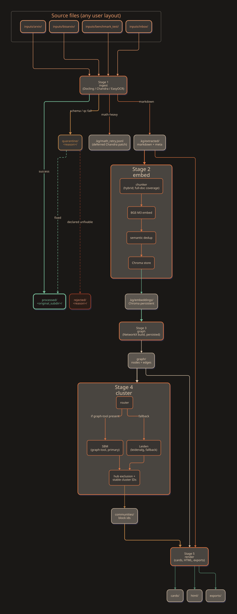

# Nuthatch

<p align="center">
  
</p>

> Local-first knowledge-graph tool for structured corpora, with
> principled clustering, strict ingest-time schema validation, and
> honest LLM token-economy accounting.

## What this is

Nuthatch turns a curated corpus (research papers, patents, internal
documents, technical reports, notes, Repomix-preprocessed codebases,
or any text-based source) into a navigable knowledge graph and
serves it to an MCP-aware agent (Claude Code, Codex, OpenCode,
Aider, Pi, Hermes, an Obsidian plugin, or your own client). The
agent queries the graph through five read-only MCP tools; the
operator drives the build pipeline through a five-stage CLI.

The rendered corpus opens as an Obsidian-compatible vault: per-paper
cards live under `cards/`, per-community pages under `communities/`,
with `dashboard.md` / `index.md` / `log.md` at the top. Wikilinks
between cards drive Obsidian's graph view; Dataview queries in the
dashboard filter by tag / year / community.

The architecture is documented in
[`docs/Design_Decisions.md`](docs/Design_Decisions.md) and the
operator workflow in [`docs/HOWTO.md`](docs/HOWTO.md). The diagram
below is the data lifecycle; the corresponding module graph and the
full architecture set are at
[`docs/architecture/`](docs/architecture/).

<p align="center">
  
</p>

## Why it exists

The graph-augmented retrieval space has working open-source
implementations (Microsoft GraphRAG, graphify, LightRAG, HippoRAG,
nano-graphrag) plus adjacent tools (Cognee, PaperQA2, Khoj, Verba).
We surveyed them and built Nuthatch anyway because we wanted a
specific combination of choices none of them makes:

- Bayesian Stochastic Block Model (Peixoto, via
  [graph-tool](https://graph-tool.skewed.de/)) as the principled
  clustering ceiling, with Leiden as a graceful fallback when
  graph-tool is unavailable
- Honest per-tool token-economy accounting (BM25 baseline for
  search, card-token-sum baseline for subgraph and community)
  instead of whole-corpus headline ratios
- Build pipeline triggered out-of-band by the operator with quality
  gates between stages, never end-to-end unattended
- Strict schema quarantine on ingest with reasoned per-file failure
  sidecars
- Authoritative metadata fetched from publisher APIs (arxiv,
  bioRxiv) rather than parsed from PDF body text
- User-extensible schema profiles supporting papers, patents,
  internal documents, and arbitrary user-defined types
- A read-only MCP query surface that the agent cannot mutate

The corpus type is a schema profile, not a category constraint.
Nuthatch is designed for any structured-corpus problem where
graph-augmented retrieval helps.

## Status

The build pipeline is operational. Five CLI subcommands
(`ingest`, `embed`, `graph`, `cluster`, `render`) chain into a
queryable corpus that the MCP server exposes via five tools
(`corpus_search`, `subgraph_extract`, `card_get`, `community_get`,
`token_econ_report`). The test suite covers every contract
(routing thresholds, model defaults, chunk coverage, reranker
invocation, schema validation, end-to-end pipeline integration).

Not yet shipped: a pre-built reference corpus, a hosted demo, a
flow diagram. PyPI publication is in flight.

## Quick start

See [`docs/HOWTO.md`](docs/HOWTO.md) for the recipe-style operator
guide covering install, corpus initialisation, the five-stage build
pipeline, MCP registration per agent host, and stop / resume
semantics. The short version:

```bash
pipx install git+https://github.com/evoclock/nuthatch.git@main
nuthatch init ~/my-corpus --register-as my-corpus --set-default

# Drop sources anywhere under the corpus root (inbox/, arxiv/,
# bioarxiv/, notes/, root-level: your choice). Then trigger each
# pipeline stage in sequence and inspect between stages.

scripts/ops/launch-stage.sh ingest  my-corpus
scripts/ops/launch-stage.sh embed   my-corpus
scripts/ops/launch-stage.sh graph   my-corpus
scripts/ops/launch-stage.sh cluster my-corpus
nuthatch render --corpus my-corpus

# Then serve it to an MCP-aware agent:
nuthatch serve --corpus my-corpus
```

## Documentation

- [`docs/Design_Decisions.md`](docs/Design_Decisions.md): the
  architectural choices and the reasoning behind each, including
  the peer-landscape survey and the token-economy methodology
- [`docs/HOWTO.md`](docs/HOWTO.md): operator runbook for the
  five-stage pipeline plus the MCP query surface
- [`docs/SPEC.md`](docs/SPEC.md): the architecture spine
- [`docs/extraction-benchmarks/ocr-comparison.md`](docs/extraction-benchmarks/ocr-comparison.md):
  evidence for the OCR routing decisions (Chandra vs Docling vs
  EasyOCR vs Granite vs SmolDocling across three representative
  scanned papers)
- Per-agent skill files (`skill-claude-code.md`, `skill-codex.md`,
  `skill-aider.md`, `skill-opencode.md`, `skill-pi.md`,
  `skill-hermes.md`) for MCP registration details and recommended
  multi-step query flows

## Licence

Apache 2.0. See [`LICENSE`](LICENSE).

## Acknowledgements

Designed by Julen Gamboa, who drove orchestration, design
discussion, and implementation decisions, with Claude Code
and Hermes (using GPT-5.5 and Minimax M2.5) as a planning
collaborators. Claude Code executed much of the implementation
tasks under that direction.

Specs and decisions are pinned in `docs/SPEC.md` and
`docs/Design_Decisions.md` so every implementation points back
to a spec entry.
