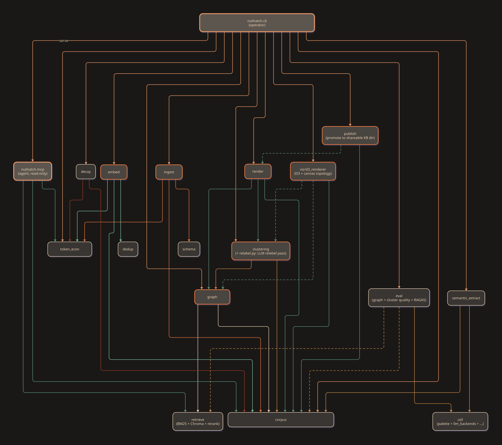

Generated from `pipeline_output/codebase_inventory.jsonl`. Pairs with `nuthatch_pipeline.html` (Mermaid) and `nuthatch_pipeline_d2.html` (D2) for the rendered diagrams. Run `scripts/ops/generate_module_summary.py` to refresh.

## Module graph (D2 rendering)

Source: `nuthatch_module_graph.d2`. Edges colored by source module (CLI=apricot, ingest=rust, embed=sage, graph=cream, clustering=ochre, render/MCP=dim sage, decay=brick).

## Package overview

| Package | Files | Purpose |
| --- | ---: | --- |
| `_top-level` | 3 | Top-level entry points: CLI (`cli.py`) and the package `__init__`. |
| `ingest` | 15 | Stage 1: extract markdown from sources, validate schema, route to `processed/<subdir>/` or `quarantine/<reason>/`. Handles arxiv / bioRxiv metadata enrichment, math-retry flagging, dedup, and orchestrator state machine. |
| `embed` | 5 | Stage 2: chunk extracted markdown and persist embeddings into Chroma (`.kg/embeddings/`). Hybrid chunker with full-doc coverage invariant; orchestrator handles incremental + `--force` re-embed. |
| `graph` | 7 | Stage 3: build the document graph from embeddings + co-citation + semantic similarity edges. Outputs to `graph/`. |
| `clustering` | 9 | Stage 4: community detection. SBM via graph-tool when available, Leiden fallback. Hub exclusion + reattachment by majority neighbour. Stable cluster IDs across re-runs. |
| `render` | 4 | Stage 5: render the corpus as an Obsidian-compatible vault. Per-paper cards under `cards/`, community pages under `communities/`, plus top-level `dashboard.md`, `index.md`, `log.md`. Wikilinks between cards form the navigable graph Obsidian's graph view picks up automatically; Dataview queries in the dashboard filter by tag / year / community. |
| `schema` | 7 | Per-corpus metadata contracts. Profiles for arxiv, bioRxiv, internal docs, patents. Profile-router picks per-file by filename pattern. |
| `corpus` | 4 | Corpus discovery, layout, init, and registry. Defines the `processed/<subdir>/` and `quarantine/<reason>/` lifecycle. |
| `retrieve` | 2 | Query-side helpers used by the MCP server: BM25, Chroma vector search, reranker invocation, hybrid result merging. |
| `mcp` | 2 | Read-only MCP server exposing five tools to agents: `corpus.search`, `card.get`, `subgraph.get`, `community.brief`, `token.report`. |
| `dedup` | 2 | Semantic dedup after embed: collapse near-duplicate chunks while respecting full-doc coverage invariant. |
| `decay` | 4 | Sprint-8 relevance decay + supersession. `relevance(t) = max(backlinks, 1) * exp(-ln2 * Δt / half_life_days)`. |
| `token_econ` | 5 | Token-economy instrumentation. Per-tool cost / yield log + report generator. |
| `scripts/bench` | 3 | Extraction-benchmark scripts (key-facts scoring, math recall, ground-truth scaffolding). |
| `scripts/ops` | 4 | Operator scripts: stage launcher (`launch-stage.sh`), this summary generator. |

## Top-level

Top-level entry points: CLI (`cli.py`) and the package `__init__`.

| Path | Purpose | Key symbols |
| --- | --- | --- |
| `src/nuthatch/__init__.py` | nuthatch: knowledge-graph tool for paper corpora with principled clustering. | _module-level only_ |
| `src/nuthatch/__main__.py` | Allow ``python -m nuthatch`` to run the CLI. | _module-level only_ |
| `src/nuthatch/cli.py` | nuthatch command-line interface (Sprint 1 surface). | `build_parser`, `main` |

## `ingest`

Stage 1: extract markdown from sources, validate schema, route to `processed/<subdir>/` or `quarantine/<reason>/`. Handles arxiv / bioRxiv metadata enrichment, math-retry flagging, dedup, and orchestrator state machine.

| Path | Purpose | Key symbols |
| --- | --- | --- |
| `src/nuthatch/ingest/__init__.py` | Ingest pipeline: inbox -> hash dedup -> (placeholder extract) -> manifest -> route. | _module-level only_ |
| `src/nuthatch/ingest/cache.py` | skip re-extraction (the expensive OCR step) when the same file with the same content + same extractor version has been processed before. Cache key = `(content_hash, extractor_version, profile_name)`;... | `CacheKey`, `SemanticCache` |
| `src/nuthatch/ingest/dedup.py` | Content-hash deduplication for inbox files. | `hash_file` |
| `src/nuthatch/ingest/extract.py` | detect whether a PDF is digital-text or scanned and dispatch to the appropriate extraction backend. Single entry point for the Sprint 2 ingest pipeline. | `ExtractionStrategy`, `ExtractResult`, `detect_text_yield`, `has_cuda`, `pick_strategy` |
| `src/nuthatch/ingest/hooks.py` | let users plug functions into the ingest pipeline at named stages without modifying nuthatch itself. Hooks can rewrite extracted markdown (e.g. domain-specific OCR fixups), enrich metadata (look up a... | `HookStage`, `HookSpec`, `HookRegistry` |
| `src/nuthatch/ingest/manifest.py` | Append-only ingest manifest. | `IngestStatus`, `ManifestEntry`, `ManifestStore` |
| `src/nuthatch/ingest/math_validator.py` | Inline-math validator for extracted markdown. | `MathValidationResult`, `classify_inline_math`, `validate_math` |
| `src/nuthatch/ingest/metadata.py` | lift the metadata fields a `SchemaProfile` requires out of an extractor's markdown, then run profile validation. Pluggable so a richer extractor (LLM-driven, like PhD KB's `01_extract_metadata.py` Cl... | _module-level only_ |
| `src/nuthatch/ingest/profile_routing.py` | Pick a `SchemaProfile` for a given source filename. | `select_profile_for_filename` |
| `src/nuthatch/ingest/qc.py` | assert pipeline-stage invariants. The Sprint 2 surface is `check_extract_yield(markdown)` — confirms an extractor produced enough text to be worth keeping. The Sprint 3 surface adds `check_chunk_cove... | `CheckResult`, `check_extract_yield` |
| `src/nuthatch/ingest/quarantine.py` | move a failed-ingest file to `<corpus>/quarantine/<reason>/` and write a `.reason.json` sidecar capturing why. Per the DECISIONS.md ingest rule, schema-failed files do NOT enter the graph and must be... | `quarantine_file` |
| `src/nuthatch/ingest/security.py` | prevent SSRF and accidental fetches of local / private addresses when the corpus accepts URL-based ingest in addition to file-system drops. Validates a URL is safe to fetch _before_ the fetch happens... | `SecurityResult`, `validate_url` |
| `src/nuthatch/ingest/source_metadata.py` | Authoritative metadata fetchers for arxiv + bioRxiv source files. | `SourceMetadata`, `extract_arxiv_id_from_filename`, `extract_biorxiv_doi_from_filename` |
| `src/nuthatch/ingest/state_machine.py` | Ingest orchestrator: walks files from a user subdir to `processed/<subdir>/`. | `IngestResult`, `IngestOrchestrator` |
| `src/nuthatch/ingest/watch.py` | Filesystem-event-driven ingest for `nuthatch watch`. | `_DebouncedHandler`, `InboxWatcher` |

## `embed`

Stage 2: chunk extracted markdown and persist embeddings into Chroma (`.kg/embeddings/`). Hybrid chunker with full-doc coverage invariant; orchestrator handles incremental + `--force` re-embed.

| Path | Purpose | Key symbols |
| --- | --- | --- |
| `src/nuthatch/embed/__init__.py` | Chunking + embedding + vector storage (Sprint 3). | _module-level only_ |
| `src/nuthatch/embed/chunk.py` | split a paper's extracted markdown into overlapping chunks suitable for embedding + retrieval, while enforcing the full-document-coverage rule from DECISIONS.md (every byte of the extracted text land... | `Chunk`, `CoverageResult`, `chunk_text` |
| `src/nuthatch/embed/embed.py` | chunk papers, embed chunks, persist to the corpus's vector store. Supports incremental mode (skip already-embedded `doc_id`s) and full reset. | `EmbedResult`, `Embedder`, `embed_document`, `already_embedded_doc_ids` |
| `src/nuthatch/embed/orchestrator.py` | Corpus-wide embed orchestrator: incremental by default, `--force` overrides. | `CorpusEmbedResult`, `embed_corpus` |
| `src/nuthatch/embed/store.py` | pluggable vector-store interface so the chunking + embedding pipeline isn't coupled to ChromaDB. ChromaDB is the default OSS backend (embedded, SQLite-backed, no GPU); FAISS and Pinecone drop in behi... | `Neighbour`, `VectorStore`, `ChromaVectorStore` |

## `graph`

Stage 3: build the document graph from embeddings + co-citation + semantic similarity edges. Outputs to `graph/`.

| Path | Purpose | Key symbols |
| --- | --- | --- |
| `src/nuthatch/graph/__init__.py` | Graph integration: entities + edges + build + io + decay (Sprint 4). | _module-level only_ |
| `src/nuthatch/graph/build.py` | assemble per-document `ExtractedEntity` sets + per-document edge lists into a single `networkx.MultiDiGraph` for the corpus. `MultiDiGraph` (not `Graph`) so the same source/target pair can carry seve... | `DocumentContribution`, `build_graph` |
| `src/nuthatch/graph/decay.py` | weight nodes by recency + connectivity so the LLM surface and the clustering layer can demote stale, unconnected papers without deleting them. Formula from `~/project-planning-agent/conventions/kb-re... | `decay_score`, `apply_decay` |
| `src/nuthatch/graph/edges.py` | every edge nuthatch writes into the graph carries an explicit confidence label so downstream consumers (the LLM surface, the clustering layer, the analytics dashboard) can weight or filter by reliabi... | `Confidence`, `Edge` |
| `src/nuthatch/graph/entities.py` | lift the entities that become graph nodes out of a paper's body and metadata. Three sources, each producing typed entities with provenance: | `EntityType`, `ExtractedEntity`, `EntityExtractor` |
| `src/nuthatch/graph/io.py` | persist the corpus graph so it survives across `nuthatch ingest` runs, and reload it for the next ingest pass without re-extracting. JSON because the graph is small (10^4 - 10^6 edges for a typical p... | `save_graph`, `load_graph` |
| `src/nuthatch/graph/orchestrator.py` | Corpus-wide graph build orchestrator. | `GraphBuildResult`, `build_graph_for_corpus` |

## `clustering`

Stage 4: community detection. SBM via graph-tool when available, Leiden fallback. Hub exclusion + reattachment by majority neighbour. Stable cluster IDs across re-runs.

| Path | Purpose | Key symbols |
| --- | --- | --- |
| `src/nuthatch/clustering/__init__.py` | Clustering: protocol + backends + router + hub exclusion + stable IDs. | _module-level only_ |
| `src/nuthatch/clustering/backends/__init__.py` | Concrete clustering backends. | _module-level only_ |
| `src/nuthatch/clustering/backends/embeddings.py` | Embedding-based clustering backend (k-means on chunk vectors). | `EmbeddingsBackend` |
| `src/nuthatch/clustering/backends/leiden.py` | Leiden clustering backend (`leidenalg` + `python-igraph`). | `LeidenBackend` |
| `src/nuthatch/clustering/backends/sbm.py` | Stochastic Block Model clustering via Tiago Peixoto's `graph-tool`. | `SBMBackend` |
| `src/nuthatch/clustering/hub_exclusion.py` | paper knowledge graphs contain a small number of enormously-cited "core" papers (the Darwins, the BLAST papers, the Word2Vec papers) that touch every community. Including them in the partition pulls ... | `core_nodes`, `exclude_core_nodes`, `reattach_by_majority_neighbour` |
| `src/nuthatch/clustering/protocol.py` | Clustering backend protocol; the first concrete spec artifact. | `Rigor`, `BackendLocation`, `ClusteringRequest` |
| `src/nuthatch/clustering/router.py` | nuthatch ships three backends (SBM, Leiden, embeddings) behind the `ClusteringBackend` protocol. At runtime not all are necessarily available (graph-tool is conda-only, leidenalg may not be installed... | `ClusteringRouter`, `default_backends` |
| `src/nuthatch/clustering/stable_ids.py` | when a corpus is re-clustered (new papers added, refit triggered), the partitioner returns community IDs that don't necessarily match the previous run. For UX continuity (saved queries, citation patt... | `remap_to_previous` |

## `render`

Stage 5: render the corpus as an Obsidian-compatible vault. Per-paper cards under `cards/`, community pages under `communities/`, plus top-level `dashboard.md`, `index.md`, `log.md`. Wikilinks between cards form the navigable graph Obsidian's graph view picks up automatically; Dataview queries in the dashboard filter by tag / year / community.

| Path | Purpose | Key symbols |
| --- | --- | --- |
| `src/nuthatch/render/__init__.py` | Per-paper artifact rendering (markdown card + HTML companion). | _module-level only_ |
| `src/nuthatch/render/card.py` | render the per-paper card that lands at `<corpus>/cards/<doc_id>.md` after ingest. The card carries Dataview-queryable YAML frontmatter and a body of structured sections (Authors, DOI, Abstract, Key ... | `slugify` |
| `src/nuthatch/render/html.py` | produce a standalone HTML file alongside the markdown card, suitable for serving figures, equations (MathJax), and rich content the markdown form cannot express well. Lands under `<corpus>/html/<doc_... | `render_html` |
| `src/nuthatch/render/obsidian.py` | write a `<corpus>/cards/`, `<corpus>/communities/`, `<corpus>/dashboard.md`, `<corpus>/index.md`, and `<corpus>/log.md` set so the corpus opens as a navigable Obsidian vault. Dataview queries in `das... | `ExportResult`, `export_vault` |

## `schema`

Per-corpus metadata contracts. Profiles for arxiv, bioRxiv, internal docs, patents. Profile-router picks per-file by filename pattern.

| Path | Purpose | Key symbols |
| --- | --- | --- |
| `src/nuthatch/schema/__init__.py` | Schema-profile machinery for the Sprint 2 ingest gate. | _module-level only_ |
| `src/nuthatch/schema/profile.py` | declare the metadata fields a document must yield to be admitted into a corpus's graph. Pluggable per corpus; the built-in profiles live in `nuthatch.schema.profiles` and the four `arxiv_paper`, `bio... | `FieldSpec`, `ValidationResult`, `SchemaProfile` |
| `src/nuthatch/schema/profiles/__init__.py` | Built-in schema profiles for the four canonical document classes. | _module-level only_ |
| `src/nuthatch/schema/profiles/arxiv_paper.py` | Schema profile for arXiv-style preprints. | `ArxivPaperProfile` |
| `src/nuthatch/schema/profiles/biorxiv_paper.py` | Schema profile for bioRxiv-style preprints. | `BiorxivPaperProfile` |
| `src/nuthatch/schema/profiles/internal_doc.py` | Schema profile for internal lab / company documents (notes, memos, drafts). | `InternalDocProfile` |
| `src/nuthatch/schema/profiles/patent.py` | Schema profile for patent documents (USPTO / EPO / WIPO). | `PatentProfile` |

## `corpus`

Corpus discovery, layout, init, and registry. Defines the `processed/<subdir>/` and `quarantine/<reason>/` lifecycle.

| Path | Purpose | Key symbols |
| --- | --- | --- |
| `src/nuthatch/corpus/__init__.py` | Corpus layout + registry: where a nuthatch corpus lives and how to find it. | _module-level only_ |
| `src/nuthatch/corpus/config.py` | let users override pipeline defaults (chunking, embedding, dedup thresholds, ...) on a per-corpus basis without editing source. The config file is optional; when absent, code defaults apply. | `EmbeddingConfig`, `CorpusConfig`, `load_corpus_config` |
| `src/nuthatch/corpus/layout.py` | Per-corpus directory layout. | `CorpusLayout`, `init_corpus`, `discover_corpus_root` |
| `src/nuthatch/corpus/registry.py` | Registry of known nuthatch corpora. | `_CorpusEntry`, `Registry`, `default_registry_path` |

## `retrieve`

Query-side helpers used by the MCP server: BM25, Chroma vector search, reranker invocation, hybrid result merging.

| Path | Purpose | Key symbols |
| --- | --- | --- |
| `src/nuthatch/retrieve/__init__.py` | Retrieval surfaces over the corpus's vector store. | _module-level only_ |
| `src/nuthatch/retrieve/vector.py` | query the corpus by similarity and return ranked chunks with metadata for an MCP server, a CLI report, or downstream LLM synthesis. Supports an optional keyword overlay for short noun-phrase queries ... | `RetrievedChunk`, `VectorRetriever` |

## `mcp`

Read-only MCP server exposing five tools to agents: `corpus.search`, `card.get`, `subgraph.get`, `community.brief`, `token.report`.

| Path | Purpose | Key symbols |
| --- | --- | --- |
| `src/nuthatch/mcp/__init__.py` | MCP stdio server for nuthatch (Sprint 6). | _module-level only_ |
| `src/nuthatch/mcp/server.py` | expose nuthatch's corpus query surface (search, subgraph extraction, card retrieval, community retrieval, token-economy reports) to MCP-aware agents (Claude Code, Codex, Hermes, Obsidian plugin, any ... | `MCPServer`, `NuthatchMCPServer` |

## `dedup`

Semantic dedup after embed: collapse near-duplicate chunks while respecting full-doc coverage invariant.

| Path | Purpose | Key symbols |
| --- | --- | --- |
| `src/nuthatch/dedup/__init__.py` | Semantic dedup pipeline (bi-encoder + optional reranker). | _module-level only_ |
| `src/nuthatch/dedup/semantic.py` | judge whether a candidate paper is a near-duplicate of any already-ingested paper. Catches preprint vs published versions, multiple PDF revisions, and OCR-rebuilt re-ingests that hash dedup misses. | `DedupOutcome`, `DedupConfig`, `Neighbour`, `classify` |

## `decay`

Sprint-8 relevance decay + supersession. `relevance(t) = max(backlinks, 1) * exp(-ln2 * Δt / half_life_days)`.

| Path | Purpose | Key symbols |
| --- | --- | --- |
| `src/nuthatch/decay/__init__.py` | Decay + supersession pass (Sprint 8). | _module-level only_ |
| `src/nuthatch/decay/frontmatter.py` | the decay pass needs to round-trip cards on disk (`<corpus>/cards/<doc_id>.md`) without disturbing their body content. Card writes happen in `nuthatch.render.card.render_card` at ingest time; this mo... | `parse_card`, `update_frontmatter`, `write_card` |
| `src/nuthatch/decay/pass_.py` | End-to-end decay pass orchestrator. | `ArchiveCandidate`, `SupersessionEvent`, `DecayResult`, `run_decay_pass`, `render_report` |
| `src/nuthatch/decay/supersession.py` | when a card declares `supersedes: [<old_doc_id>, ...]` in its frontmatter, the decay pass must: | `SupersessionPair`, `SupersessionResult`, `find_supersession_pairs`, `apply_supersession` |

## `token_econ`

Token-economy instrumentation. Per-tool cost / yield log + report generator.

| Path | Purpose | Key symbols |
| --- | --- | --- |
| `src/nuthatch/token_econ/__init__.py` | Token-economy instrumentation (Sprint 7). | _module-level only_ |
| `src/nuthatch/token_econ/counterfactual.py` | Per-tool counterfactual estimators for the token-economy report. | `CounterfactualEstimator`, `CardTokenIndex`, `BM25Counterfactual`, `build_default_estimator` |
| `src/nuthatch/token_econ/log.py` | persistent record of every MCP query the surface served + its measured cost. Append-only so the file survives crashes; one record per line so streaming readers handle very-long logs without loading t... | `TokenRecord`, `TokenLog` |
| `src/nuthatch/token_econ/measure.py` | take what a single MCP tool call SERVED to the consuming surface and compute how many tokens it represents, alongside the counterfactual cost of having sent the WHOLE corpus instead. The ratio is nut... | `count_tokens`, `measure_query` |
| `src/nuthatch/token_econ/report.py` | turn the per-query records in `<corpus>/.kg/token_log.jsonl` into summary stats the user reads in Obsidian and the MCP `token_econ_report` tool returns as JSON. | `GroupRow`, `ReportSummary`, `aggregate`, `summary_as_dict` |

## `scripts/bench`

Extraction-benchmark scripts (key-facts scoring, math recall, ground-truth scaffolding).

| Path | Purpose | Key symbols |
| --- | --- | --- |
| `scripts/bench/key_facts.py` | per-paper checklist scorer for OCR extraction benchmarks. Given a paper id and an OCR markdown output, check whether each known key fact appears in the output. Binary score per fact; the aggregate is... | _module-level only_ |
| `scripts/bench/math_recall.py` | count math notation an OCR tool preserved in its output. The key_facts checklist probes textual facts and misses what differentiates OCR tools on math-heavy papers (equation fidelity, LaTeX rendering... | _module-level only_ |
| `scripts/bench/ref_recall.py` | count distinct numbered reference entries in an OCR markdown output. Used by the extraction benchmark in docs/extraction-benchmarks/ to quantify which OCR tool extracted the most-recoverable bibliogr... | `count_distinct_refs`, `main` |

## `scripts/ops`

Operator scripts: stage launcher (`launch-stage.sh`), this summary generator.

| Path | Purpose | Key symbols |
| --- | --- | --- |
| `scripts/ops/audit_external_repo.py` | Generate a per-script audit markdown for a non-nuthatch repo (kestrel-latest, kestrel-v8, etc.) without requiring an inventory pre-generated in that repo. Walks `.py` files under a given root, parses... | _module-level only_ |
| `scripts/ops/generate_module_summary.py` | Produce a per-package per-script summary markdown from the repo-local `pipeline_output/codebase_inventory.jsonl`. Output is a Dataview-friendly section per package plus a top-level table. | _module-level only_ |
| `scripts/ops/launch-stage.sh` | _no docstring_ | _module-level only_ |
| `scripts/ops/render_d2_diagrams.sh` | _no docstring_ | `render_one` |
